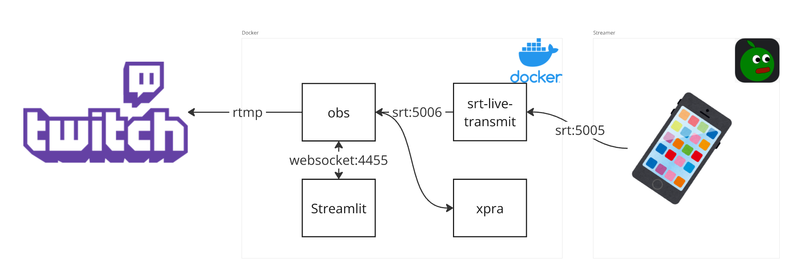

## はじめに

配信プラットフォームでよく見かける「[IRL配信(外配信)](https://www.twitch.tv/directory/category/irl)」。街中や山の上など、様々な場所で配信するコンテンツですが、モバイル回線の不安定さが大きな課題となっています。この課題を解決するのが「[IRLToolkit](https://irltoolkit.com/)」というサービスです。

今回は、このIRLToolkitの主要機能を備えた自作バージョンを開発したお話です。

## IRLToolkitとは

IRLToolkitは、不安定なモバイル回線でも安定した配信を実現するためのサービスです。特徴は以下の通りです：

- 配信デバイスからの映像を一旦中継サーバーで受け取り、そこから配信プラットフォームへ送信
- ネットワークが途切れても配信が継続できる
- ダッシュボードから配信のコントロールが可能

## 自作版の実装内容

### 主要機能

1. 配信機能
   - SRTプロトコルでの映像・音声受信
   - RTMPプロトコルでの配信プラットフォームへの送信
   - ネットワーク不安定時の代替映像表示

2. ダッシュボード機能
   - リアルタイムスクリーンショット表示
   - 配信状態の監視(配信状態、マイク状態)
   - 基本的な配信コントロール(開始/停止、ミュート)
   - ビットレートのリアルタイムプロット

3. リモート設定機能
   - OBS Studioのリモート操作機能

右側がダッシュボード機能、左側がリモートデスクトップです。

### 技術スタック

- コンテナ化：Docker
- 配信システム
  - 映像受信：SRT ([srt-live-transmit](https://github.com/Haivision/srt/blob/master/docs/apps/srt-live-transmit.md))
  - 配信エンジン：[OBS Studio](https://obsproject.com/)
  - 制御インターフェース：OBS Websocket
- UI実装：[Streamlit](https://streamlit.io/)
- リモート操作：[xpra](https://github.com/Xpra-org/xpra)

### システム構成

単一のDockerコンテナ内で全機能が動作する構成を採用しました：

1. 映像フロー
   - 配信デバイス → srt-live-transmit → OBS Studio → 配信プラットフォーム

2. 制御フロー
   - Streamlitダッシュボード ↔ OBS Websocket ↔ OBS Studio

本来は、`srt-live-transmit`を利用せずともOBS Studioで直接srtで伝送された映像を受信できます。
しかし、今回は受信ビットレートをダッシュボードにプロットするという要件があるため、一度`srt-live-transmit`を経由し、受信した統計情報を名前付きパイプに吐き出させています。
名前付きパイプをStreamlitアプリから読み取る事でリアルタイムに受信したビットレートを確認できるようにしています。

## コスト比較

商用のIRLToolkitは月額$129(約19,000円)かかりますが、自作版では：

- 自宅ホスティング：実質無料
- AWS ECS利用時：約150円/時間（Tokyo リージョン、vCPU:16、RAM:32GB構成）

(ネットワーク料金を無視すれば)5日(126時間)以内の利用であれば、自作版の方が安く利用できます。

## 今後の展望

IRLToolkitには搭載されていて、今回のアプリケーションでは実装できなかったものとして、[SRTLA(SRT Link Aggregation)](https://github.com/BELABOX/srtla)への対応があります。これは複数のモバイル回線を束ねて安定性を向上させる技術ですが、利用した環境の問題で実装する事ができませんでした。
今後対応したいと考えています。

## 参考リンク

- [IRLToolkit](https://irltoolkit.com/)
- [BELABOX](https://belabox.net/)
- [Free Relay Hosting for your SRT, SRTLA or RTMP IRL stream](https://youtu.be/HdXAc8GyEyU)
- [Haivision/srt](https://github.com/Haivision/srt)
- [Xpra-org/xpra](https://github.com/Xpra-org/xpra)
- [OBS Studio](https://obsproject.com/)
- [Streamlit](https://streamlit.io/)
