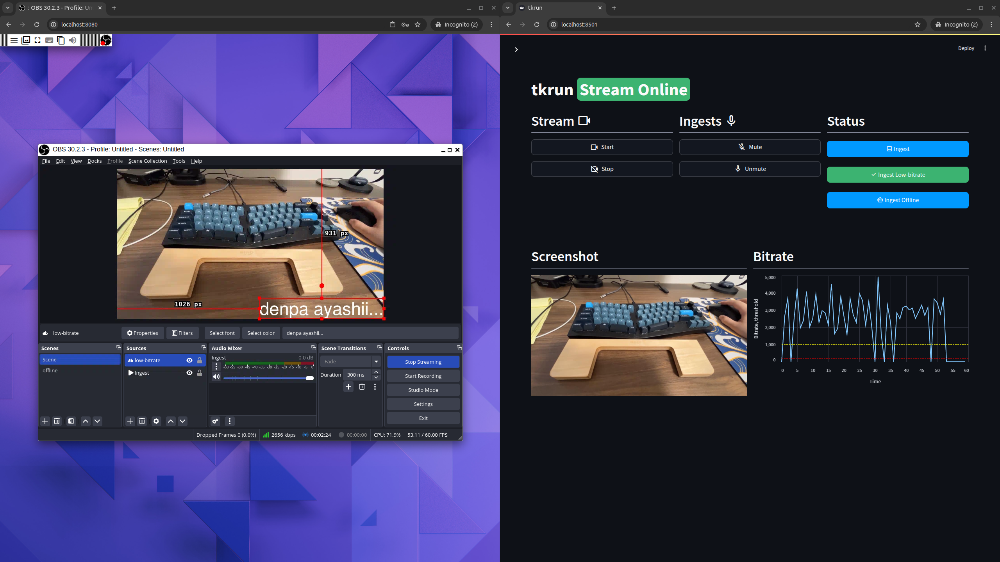

## IRLToolkitとは

Twitchなどの配信サービスで配信ジャンルの一つにIRL(In Real Life/外配信)というものがある。

IRL配信では、コンパクトな機材で街中から山の上まで色々な場所に行き、その体験を視聴者にも共有するというモノで、私はよく見ている。
IRLは外配信なわけで、配信場所が環境の整ったスタジオなどではなく、街中から山の上まで様々な場所が配信場所になる。

コンパクトな機材で、どこからでも配信をするためにスマートフォンからモバイル回線を利用しようとするが、実際にやってみると意外と通信が不安定になる。

[IRLToolkit](https://irltoolkit.com/)は、そんなネットワークの不安定なモバイル回線で安定した配信をするためのサービスです。

IRLToolkitでは、手元の映像送信デバイスから直接配信プラットフォームに送信するのではなく、一度IRLToolkitのサーバーに送信し、IRLToolkitのサーバーから配信プラットフォームのサーバーに再度送信します。

これにより、次のような恩恵が得られます

- 配信デバイスのネットワークが途切れてしまっても、配信が止まらない
- ダッシュボードから、配信の開始/停止などのコントロールができる

IRLToolkitのダッシュボード画面(https://account.irltoolkit.com/plugin/support_manager/knowledgebase/view/2/quick-start-guide/3/)

今回は、これらの機能を持つIRLToolkitの簡単なクローンを実装しました。

## IRLToolkitの機能(機能要件)

まず、作るにあたっての機能要件を簡単に定めます。

- 配信
  - 配信デバイスからSRTで映像と音声を受け取る
  - 配信デバイスから受け取った映像と音声とRTMPで配信プラットフォームに送信する
  - 配信デバイスのネットワークが不安定な場合に、映像を差し込む
- UI(ダッシュボード)
  - 配信のステータスを確認
    - スクリーンショット
    - 配信中かどうか
    - マイクがミュートかどうか
  - 配信の開始/停止ボタン
  - 音声のミュート/非ミュート
  - 配信デバイスからの受け取ったデータのビットレートをプロット
- リモートデスクトップ
  - 細かい設定を行うために、裏側で動作するOBS Studioをリモートデスクトップで操作する

## 作ったもの

できた物がこれらです。

右側がダッシュボードで、左側がリモートデスクトップの画面です。

### 構成技術

構成技術としては、これらです。

- [Docker](https://www.docker.com/)
- 配信
  - [srt](https://github.com/Haivision/srt/tree/master) 
  - [OBS Studio](https://obsproject.com/)
  - [OBS Websocket](https://github.com/obsproject/obs-websocket)
- UI(Dashboard)
  - [Streamlit](https://streamlit.io/)
- リモートデスクトップ
  - [xpra](https://github.com/Xpra-org/xpra)

### もうちょっと細かく

今回作成した自作IRLToolkitは、単一のDockerコンテナ上で動作します。コンテナ上で配信用のOBS Studioとダッシュボード用のStreamlitアプリケーションが動作します。

ダッシュボード側で行った操作はOBS Websocketを経由してOBS Studioに反映されます。
また、サーバー側で受け取った映像をダッシュボードで確認するために、映像のスクリーンショットを1秒に1度取得して確認できるようにしてあります。これもOBS Websocket経由でStreamlit側で取得しています。

配信デバイスからSRTで映像が送出され、サーバー側で受け取ります。この時、OBS Studioで直接受け取る事もできますが、今回はSRTの[srt-live-transmit](https://github.com/Haivision/srt/blob/master/docs/apps/srt-live-transmit.md)で一度映像を受け取り、それを更にOBS Studioに送出しています。

映像デバイスから受け取ったデータのビットレートをダッシュボードに出力するために、`srt-live-transmit`を経由しています。

最終的に配信プラットフォームにデータを送出するのにはOBS Studioを利用しています。そのため、Websocketでは設定しきれない設定などもあり、これらを細かく設定するために、xpraというリモートデスクトップアプリケーションを利用し、リモートデスクトップもできるようにしてあります。

### 費用

今回自分で作った大きな理由の一つが費用です。

IRLToolkitは普通に利用しようとすると、毎月$129=19000円($1=¥150)もかかります。
自分のような、なんちゃってゆるふわストリーマーにとってはかなり高額です。

自分で作成したため、自宅でホストする分には無料で利用できます。
自宅でホストするとネットワークの制約などが面倒です。
なので個人で利用する場合は、利用中だけ[AWS ECS](https://aws.amazon.com/jp/ecs/)にTaskとしてデプロイしています。

今回のアプリケーションは、単一のDockerイメージで作成されているため、簡単にデプロイする事ができます。また、費用もvCPU:4、vRAM:8で運用できるため、コンピューティングだけの費用であればTokyoリージョンで1時間37円程度になります。

なので、513時間(21日間)以上配信をつけ続けない限りは、自作したツールのほうが安上がりです。

(実際は、さらにインスタンスからのネットワークの送出の費用もかかるので、もう少し少なくなります)

## 展望

IRLToolkitにあって、今回の自作IRLToolkitには搭載できなかった仕組みがひとつだけあります。それが[SRTLA(SRT Link Aggregation)](https://github.com/BELABOX/srtla)です。
最近の配信デバイスでは、2つのモバイル回線をまとめて(ボンディング)して、より安定した通信を行う事ができます。
ボンディングされた映像を受け取るための仕組みがSRTLAなのですが、今回利用した環境では動作しなかったため、機能を断念しました。
時間のある時に、既存のSRTLAを修正するか真似するかして動作するようにしたいと考えています。

## 参考

- [IRLToolkit](https://irltoolkit.com/)
- [BELABOX](https://belabox.net/)
- [Free Relay Hosting for your SRT, SRTLA or RTMP IRL stream](https://youtu.be/HdXAc8GyEyU?si=u0qbbKTpgCh2kzsC)
- [Haivision/srt](https://github.com/Haivision/srt)
- [Xpra-org/xpra](https://github.com/Xpra-org/xpra)
- [OBS Studio](https://obsproject.com/)
- [Streamlit](https://streamlit.io/)
