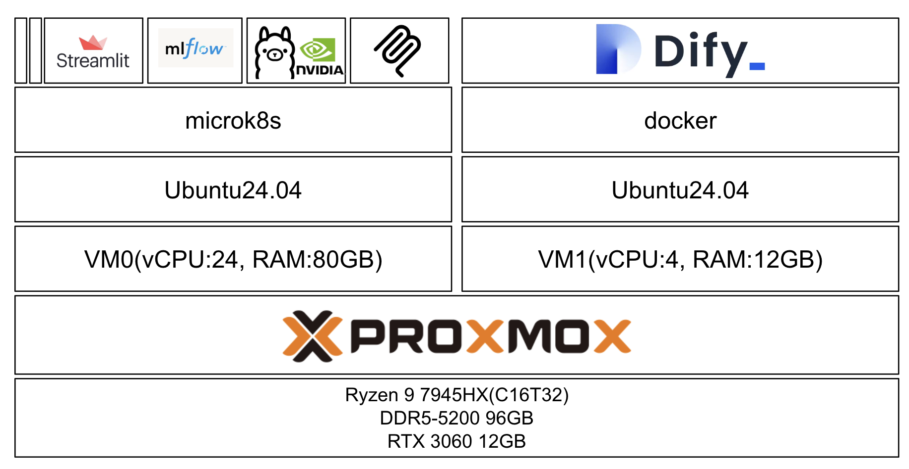

## 自宅サーバーを立てた

勉強(遊ぶ)ためになんとなく自宅にサーバーを立てたくなった結果、気づいたら色々ポチっていた。

### スペック

- CPU: AMD Ryzen9 7945HX(16Core/32Thread)([Amazonリンク](https://amzn.asia/d/6mbnDRS))
- RAM: DDR5-5200 SODIMM 96GB(48GBx2)([Amazonリンク](https://amzn.asia/d/cIuUlz5))
- GPU: NVIDIA RTX3060 12GB[Amazonリンク](https://amzn.asia/d/fWRtqEB)
- クーラー: Corsair NAUTILUS 240 RS[Amazonリンク](https://amzn.asia/d/6JneBW1)
- ストレージ: NVMe 2TB[Amazonリンク](https://amzn.asia/d/eozJwgU)
- 電源: 玄人志向 80PLUS Bronze 650W[Amazonリンク](https://amzn.asia/d/auRqT3H)
- ケース: LianLi A3-mATX Black[Amazonリンク](https://amzn.asia/d/cM37PPS)

### 組む時に考えていたこと

1. PROXMOXを使ってVMを建てたいから、コア数(スレッド数)を多くしたい
1. Ryzen CPUを使ったことがないから使ってみたい
1. VRAMのコスパはAMDの方が良いけど、まだまだCUDAがデファクトスタンダードだから選択しづらい
1. メインPCがあるからGPUにはそんなにお金をかけない。
1. ピカピカゲーミングで眩しくない

## サーバーで立っているもの

サーバーはざっくり以下のイメージで構成されている。

現時点で、microk8sとDifyのVMが立っている。\
リソースの配分はこんな感じ。

| リソース | microk8s | Dify | 余り |
|:-:|:--:|:---:|:--:|
| vCPU | 24 | 4 | 4 |
| RAM | 80 | 12 | 4 |
| ストレージ | 1TB | 512GB | 400GB | 
| その他 | GPU | - | - |

### microk8s

microk8sでは、常時以下のものを動かしている

- [mlflow tracking server](https://github.com/mlflow/mlflow)
- MCPサーバー
- streamlitアプリ

これらとは別に、必要な時に動かすものは以下のもの

- [ollama](https://github.com/ollama/ollama)

### Dify

[langgenius/dify](https://github.com/langgenius/dify)をVMに`docker-compose`を利用してセルフホストしている。

このDifyでは、[3dify-project/dify-mcp-client](https://github.com/3dify-project/dify-mcp-client)を利用して、microk8s上にデプロイしているMCPサーバーにDifyのワークフローやチャットからアクセスできるようにしている。

